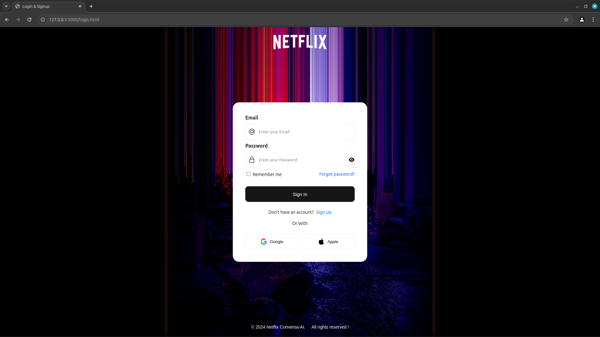

# NETFLIX CONVERSA AI

## Description

A Netflix clone integrated with Gemini AI Chatbot for personalized movie and series recommendations. This platform combines Netflix’s browsing capabilities with AI-powered suggestions to enhance the streaming experience. Users can explore Netflix-exclusive content, view trailers, and get intelligent recommendations based on their preferences.

## Features

Core Functionality

    User Authentication: Sign up, login, and logout functionalities powered by Firebase.
    Personalized Recommendations: AI-based suggestions using OpenAI GPT-3 and TMDB API.
    Dynamic Movie Lists: Fetch real-time Netflix-only movies and series from TMDB API.
    Language Preferences: Multi-language support for a localized experience.
    Movie Trailers: Embedded YouTube trailers with autoplay and mute functionality.
    Responsive Design: Fully responsive UI powered by Tailwind CSS.

AI-Powered Chatbot (NetflixConversaAI)

    Input queries like “Top action movies” or “Romantic series in Hindi”.
    Real-time processing of user queries through GPT-3.
    Display AI-generated movie and series suggestions with Netflix viewable links.

---

for more information read the file.
